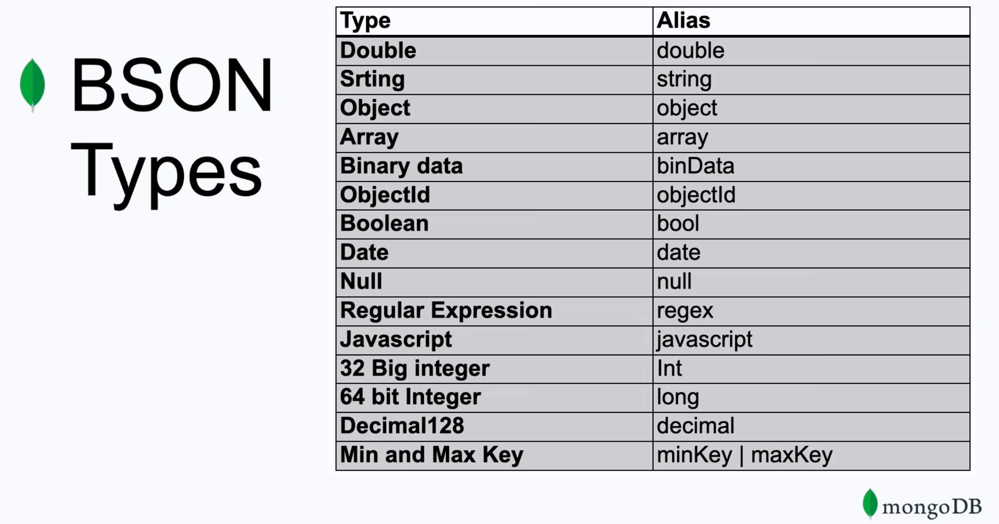

# Spring Boot - MongoDB

Mongo Docker

```bash 
docker run -d --name container_name -e MONGO_INITDB_ROOT_USERNAME=admin -e MONGO_INITDB_ROOT_PASSWORD=password -p 27017:27017 mongo
```

Swagger: <http://localhost:8080/swagger-ui/>

Api-Docs: <http://localhost:8080/v3/api-docs>

## Documents

MongoDB stores data records as BSON documents. BSON is a binary representation of JSON document.



